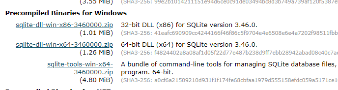
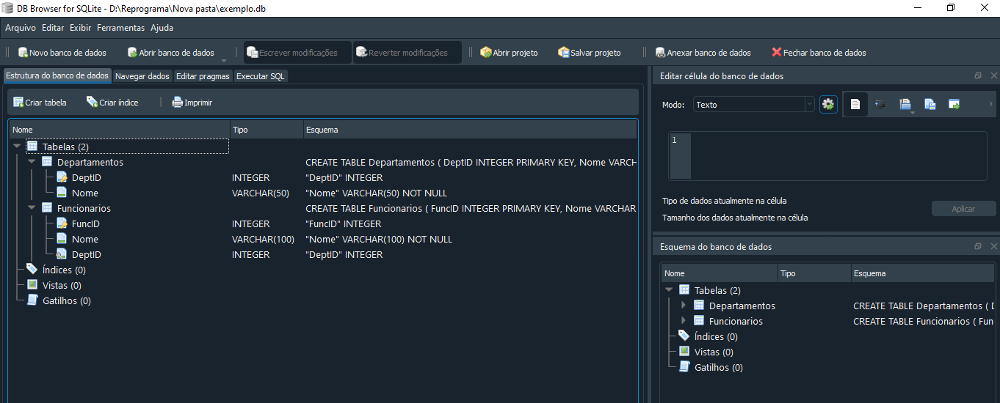

<h1 align="center">
  
</h1>

# Revisão Joins

Turma Online 29 | 2024 | Professora Edilene

### Instruções
Antes de começar, vamos organizar nosso setup.
* Fork esse repositório 
* Clone o fork na sua máquina (Para isso basta abrir o seu terminal e digitar `git clone url-do-seu-repositorio-forkado`)
* Entre na pasta do seu repositório (Para isso basta abrir o seu terminal e digitar `cd nome-do-seu-repositorio-forkado`)
* [Add outras intrucoes caso necessario]

### Resumo
O que veremos na aula de hoje?
* [Antes da Aula](#tema1)
* [Tipos de Joins](#tema2)
* [Agrupamento](#tema3)

#### Usaremos o sqlite online na aula, como de costume

##  **Antes da aula**  :clipboard:
  
### Caso tenha interesse em usar o Sqlite no Vscode ou o Browser 

- ter as extensões instaladas no VsCode : sqlite;  SQLite Viewer

- para criar o banco de dados no vscode, é preciso usar o terminal

- e no terminal, usar o .\sqlite3

Esse comando já abre o sqlite e cria o banco    
sqlite3 exemplo.db

Caso não funcione, vamos instalar no windows:

--acessar o [site](https://www.sqlite.org/download.html) procurar as libs para windows:

Temos também a opção de usar o DB.Browser for Sqlite
link para [download:](https://sqlitebrowser.org/)

## Conteúdo
### Tema1 
1. [Para que servem os joins](#topico1)
   
### Tema2 
1. [Quando usar cada um](#topico2)
  
   
### Tema3
1. [Agrupamento](#topico4)

### Tema1 

A palavra chave JOIN é usada para obter dados provenientes de duas ou mais tabelas, baseado num relacionamento entre colunas destas tabelas.

### Tema2

Alguns tipos de Joins: inner, left, right, full, cross

### Tema3
Agrupar resgistros em subgrupos baseados em colunas ou valores retornados por uma expressão.

***
### Exercícios 
* [Exercicio para sala](https://github.com/mflilian/repo-example/tree/main/exercicios/para-sala)
* [Exercicio para casa](https://github.com/mflilian/repo-example/tree/main/exercicios/para-casa)

### Material da aula 

### Links Úteis
- [Dev Media](https://www.devmedia.com.br/sql-join-entenda-como-funciona-o-retorno-dos-dados/31006)
- [Alura](https://www.alura.com.br/artigos/join-em-sql)
- [Video](https://www.youtube.com/watch?v=3IdKyi-KezU&themeRefresh=1)

Desenvolvido com :purple_heart:  

